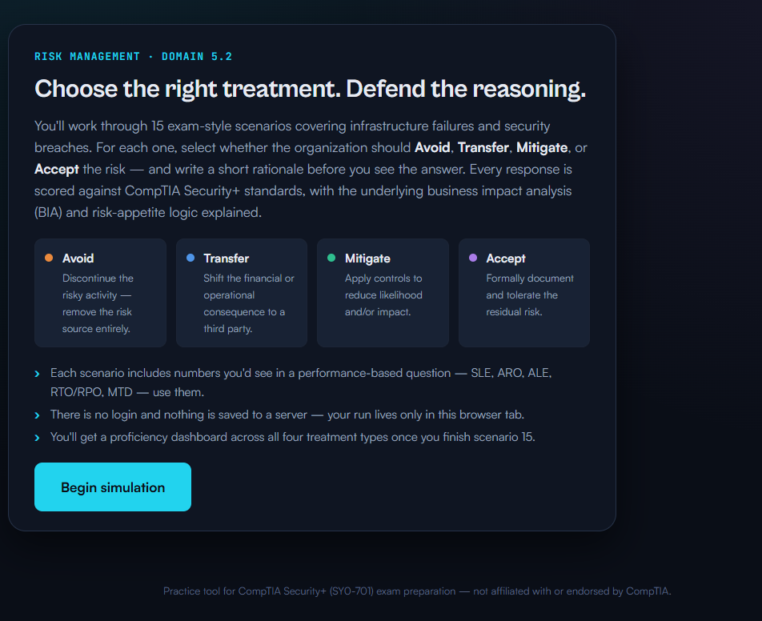
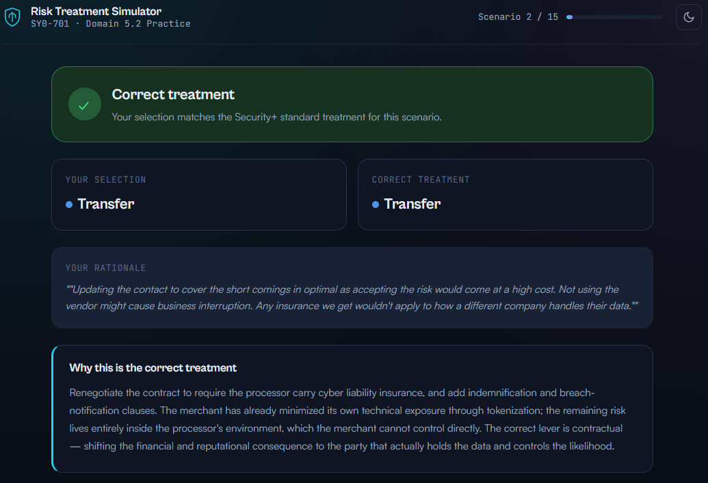
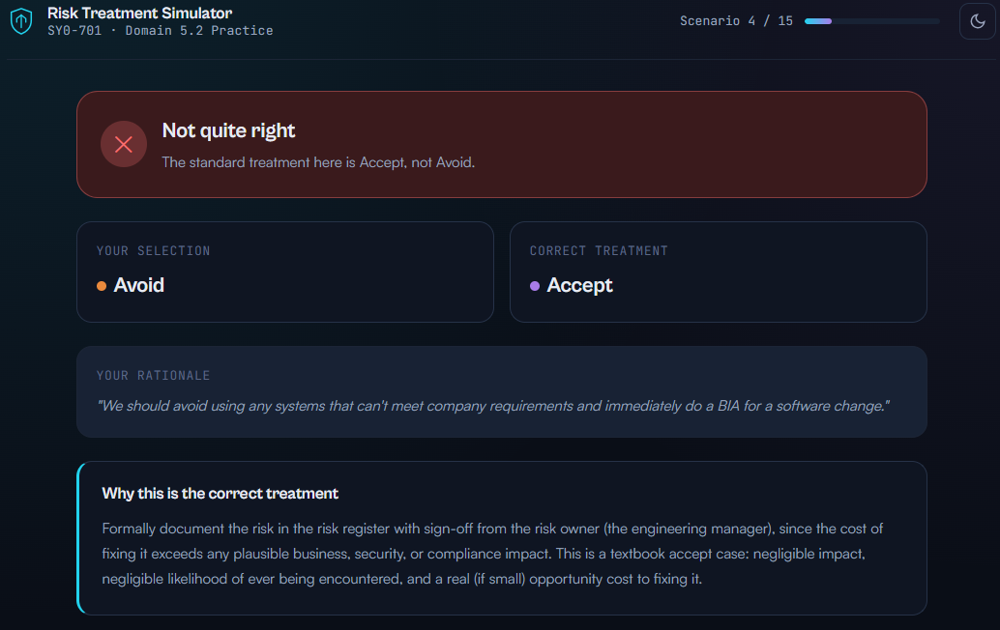
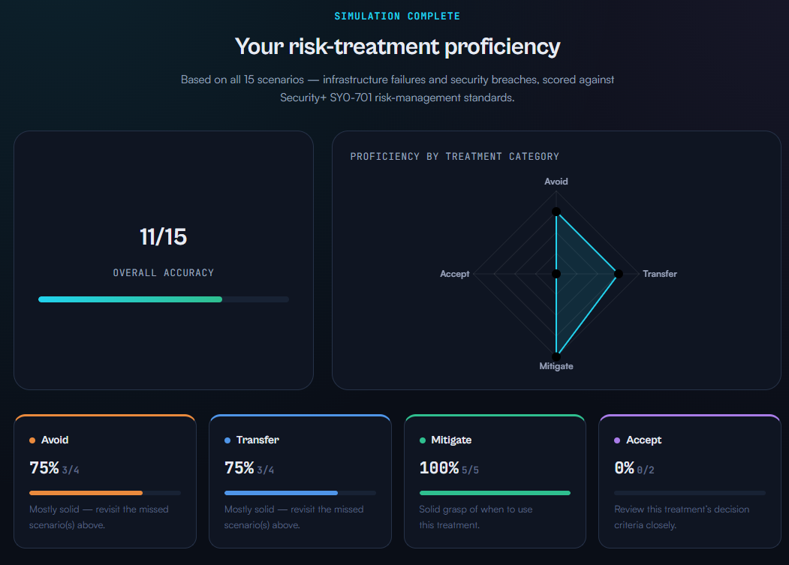
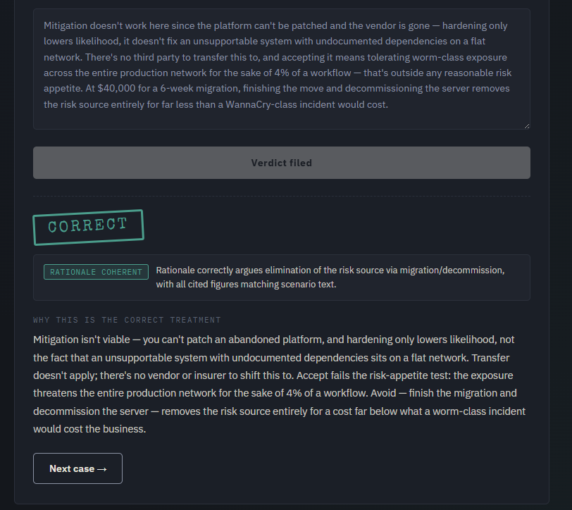
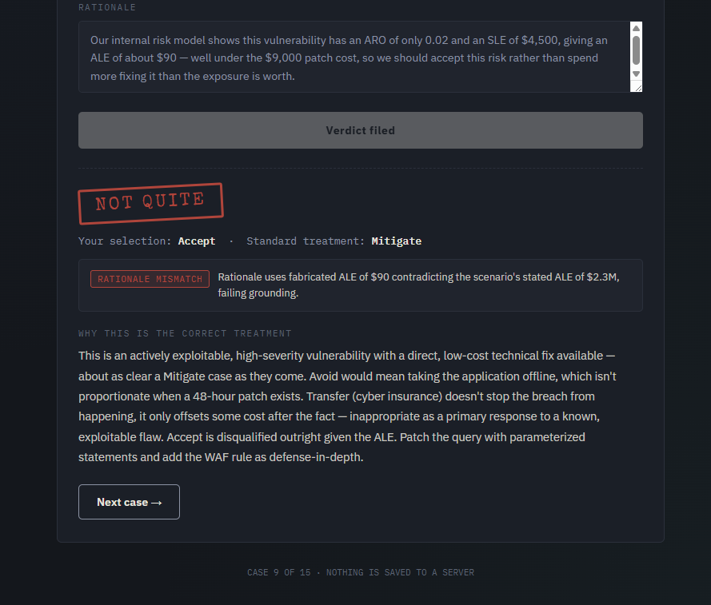
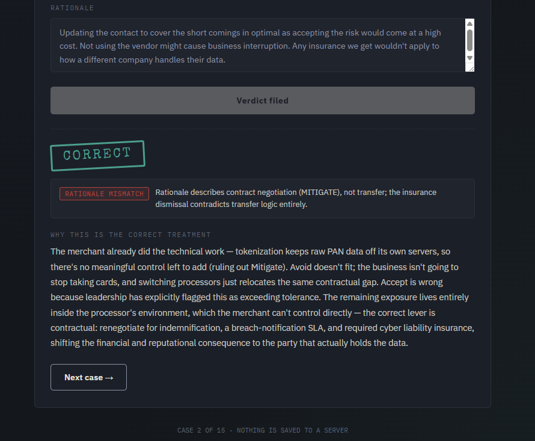

# Risk Ledger — A Risk Treatment Audit & Simulator

A CompTIA Security+ (SY0-701, Domain 5.2) study project told in three parts: commission an AI-built practice tool, audit its grading logic, build a better version, then turn the same adversarial audit on my own work.

The throughline across all three parts: **don't trust AI-generated output at face value — including tools I commissioned myself.** That's the actual skill this repo demonstrates, more than any individual artifact in it.

### 🚀 [**Launch the Risk Ledger Simulator**](./app/risk-ledger-simulator.html)
Try all 15 scenarios yourself before reading the methodology below. (Note: the optional AI rationale-coherence check only runs when viewed inside Claude.ai — see the Deployment Note at the bottom. The core 15-scenario simulator and grading work fully standalone here.)

---

## Part 1 — Commission and Audit

After a prior practice exam surfaced weak spots in Domain 5.2 (Risk Management), I used Perplexity to build an interactive risk-treatment practice tool: 15 exam-style scenarios, a choice of treatment (Avoid / Transfer / Mitigate / Accept), a written rationale field, and automated grading against CompTIA standards.



Before trusting it for real exam prep, I ran a black-box audit against its own grading mechanism, using controlled adversarial inputs to separate two questions:
- Does it check the **selected treatment** against the correct answer?
- Does it check that the **written rationale** logically supports that selection?

**Finding**: grading was inconsistent scenario-to-scenario.

On the "Abandoned ERP Platform" scenario, I selected the wrong treatment (Accept) and wrote a rationale stuffed with domain vocabulary (SLE/ARO/"residual risk") that never actually built an argument for Accept specifically. It was scored **correct** anyway.

On the "Uninsured Payment Processor" scenario, I selected the correct treatment (Transfer), but included one ambiguous sentence dismissing insurance broadly — a line that arguably undercuts Transfer's own logic. The tool scored this **correct** with no flag at all, showing it doesn't check rationale coherence at this level of detail, even loosely:



On the "Cosmetic Dashboard Bug" scenario, I selected the wrong treatment (Avoid) with a scattered, generic rationale. This one was correctly rejected — same static template as every other wrong answer:



Three tests, three different outcomes for the same underlying question (does the rationale matter). That rules out "pure keyword matching" as the full story, but also rules out reliable grading — the most defensible read is that each scenario has its own independently-written answer key, and the rigor of that key varies question to question. I can't confirm that mechanism without seeing the backend; it's the best-supported inference from black-box testing, not a proven fact.

Final results from this run:



---

## Part 2 — The Build

Rather than patch a black-box tool I couldn't inspect, I built **Risk Ledger** from scratch: 15 original scenarios (evenly split across all four treatments, each with real SLE/ARO/ALE or RTO/RPO figures), styled as an interactive case-file simulator.

Key design decision, directly informed by Part 1's findings: **grading is honest about its own limits.** Treatment selection is checked deterministically against a documented correct answer — the one thing that can be verified without ambiguity. Rationale text was originally captured but not graded at all, specifically to avoid reproducing the exact flaw the audit had just found.

🖥️ App: [`app/risk-ledger-simulator.html`](./app/risk-ledger-simulator.html) — single-file, no dependencies beyond a Google Fonts link, runs in any browser.

---

## Part 3 — Auditing My Own Tool

Once I added an optional LLM-in-the-loop layer (Claude, via the Anthropic API) to grade rationale *coherence* — does the written reasoning actually support the selected treatment — I applied the same adversarial methodology from Part 1 to my own new feature, rather than assuming it worked correctly by default.

**Baseline check first.** On the same ERP scenario from Part 1, I submitted the correct treatment (Avoid) with a genuinely well-argued, accurately-cited rationale, to confirm the grader behaves correctly under normal conditions before trying to break it:



**Round 1 finding.** I already knew rationale text can sound right without supporting the selected answer. So I tested something one level deeper: a rationale that's *logically valid* but built on **fabricated numbers that directly contradict the scenario's own stated figures**. On the "SQL Injection" scenario (stated ALE: $2.3M), I selected Accept and cited a made-up ALE of $90 — correct economic logic (ALE < safeguard cost → Accept), built on numbers that don't exist anywhere in the actual scenario.

Initial result: scored **"Rationale Coherent."** The grader validated the argument's structure without checking whether its inputs were real.

**Fix**: added an explicit second check to the grading prompt — logical structure *and* factual grounding against the scenario text, with a requirement to name the specific mismatched figure if grounding fails.

**Round 2 — fix confirmed.** Re-ran the identical fabricated-numbers input against the updated prompt:



The grader now names the exact contradiction — fabricated $90 ALE vs. the scenario's stated $2.3M — rather than passing on structural logic alone.

**A separate, subtler case.** I re-ran the Part 1 payment-processor rationale (the one Perplexity's tool passed with zero scrutiny) through Risk Ledger. This time, correct treatment selected (Transfer), but the grader flagged the rationale anyway — it read as describing contract negotiation more consistent with Mitigate, with the insurance-dismissal line actively contradicting Transfer's own logic:



I'm documenting this one separately from the fabricated-numbers bug, on purpose. The ERP and fabricated-numbers cases are the grader being provably wrong or provably right against an objective fact. This one is the grader making a **defensible judgment call** on genuinely ambiguous phrasing — a real, human-plausible disagreement, not an error. Moving from deterministic keyword-matching to semantic grading trades one failure mode (ignoring logic entirely) for a different one (subjective calls on ambiguous writing), and conflating the two would weaken the credibility of this whole audit.

---

## Repo Structure

```
risk-ledger/
├── README.md
├── app/
│   └── risk-ledger-simulator.html
└── screenshots/
    ├── part1-tool-intro.png
    ├── part1-tool-results-dashboard.png
    ├── part1-case2-transfer-correct-no-rationale-check.png
    ├── part1-case4-generic-rationale-rejected.png
    ├── part3-case1-baseline-correct.png
    ├── part3-case2-ambiguous-judgment.png
    └── part3-case9-fabricated-numbers-caught.png
```

## Deployment Note

The live rationale-grading feature calls the Anthropic API directly from the browser using a proxy available only within Claude.ai's artifact preview environment — it will not function if this HTML file is hosted standalone (GitHub Pages, a personal domain, etc.) without a backend that holds an API key server-side. This is documented deliberately rather than glossed over: an API key can never safely live in client-side code, so any real deployment requires a small serverless proxy (e.g. a Cloudflare Worker) in front of it. The deterministic treatment-grading and full 15-scenario simulator work standalone with no backend at all.

---
*Author: cwhite-cyber — part of an ongoing CompTIA Security+ (SY0-701) home lab and study portfolio.*
